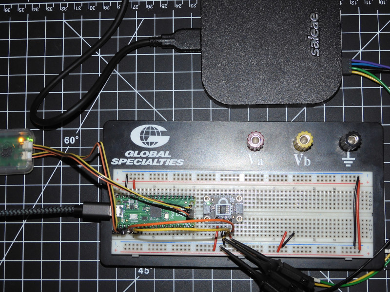

# ATECC608A Pico

## Overview

This project is designed to interface the Microchip ATECC608A Cryptographic Co-processor with a Raspberry Pi Pico. The demo supports TRNG, SHA, and AES.

## Features

- ✅ **Wake-up & Communication**: Initializes and wakes up the ATECC608A over I2C.
- 🔎 **Read Configuration Data**: Reads and displays the device's configuration zone.
- 🔐 **Check Lock Status**: Determines whether the ATECC608A is locked or unlocked.
- 🎲 **Generate Random Numbers**: Utilizes the ATECC608A’s True Random Number Generator.
- 🔢 **Compute SHA-256 Hash**: Computes a SHA-256 hash of a message using the ATECC608A.
- 📜 **Retrieve Serial Number**: Reads and displays the unique serial number of the device.
-    **AES 128-bit Encryption**: Performs an encryption and decryption operation using ATECC608A.
- 🛠 **I2C Communication**: Implements sending and receiving commands using the Pico I2C interface.

## Hardware Requirements

- Raspberry Pi Pico / Pico2 (or any RP2040 or RP2350 board)
- Microchip ATECC608 (A or B variant, I2C interface)
- Pull-up resistors (4.7kΩ) for SDA and SCL
- Jumper wires for I2C connections

## Wiring Guide

| Raspberry Pi Pico | ATECC608A |
|-------------------|-----------|
| GP4 (SDA)         | SDA       |
| GP5 (SCL)         | SCL       |
| GND               | GND       |
| 3.3V              | VCC       |

## Software Requirements

- CMake (for building the project)
- Pico SDK (for Raspberry Pi Pico development)
- GNU Arm Toolchain (for compiling the project)
- VS Code + CMake Tools (recommended for development)

## Installation & Setup

1. Clone the repository:
    ```sh
    git clone git@github.com:retromanc3r/pico_atecc.git
    cd pico_atecc
    ```

2. Initialize the Pico SDK:
    ```sh
    git submodule update --init --recursive
    ```
   The script `scripts/install-pico-sdk.sh` can also be used to fetch and
   configure the Pico SDK automatically, which is useful in testing
   environments.

3. Build the project:
    ```sh
    mkdir build
    cd build
    cmake ..
    make
    ```
    Use this `cmake` command instead when building for the Raspberry Pi Pico2.
    ```sh
    cmake -DPICO_BOARD=pico2 ..
    ```

4. Flash the firmware onto the Pico:
    - Hold the BOOTSEL button on the Pico and connect it to your PC.
    - Copy the generated `pico_atecc.uf2` file to the `RPI-RP2` USB drive.

## Usage

1. Run the firmware and view output:
    ```sh
    minicom -b 115200 -o -D /dev/ttyACM0
    ```
    or
    ```sh
    minicom -b 115200 -o -D /dev/ttyUSB0
    ```

2. Expected Output (Locked) IS configured for AES
    ```
    📡 Initializing ATECC608A...                                                 
    🛰️ **Wake-up Response:** 04 11 33 43                                          
    ✅ Wake-up successful!                                                       
    🆔 Serial Number: 0123BFBDEA185823EE                                         
    🎲 Random Number (Mapped to Range 100-65535): 11119                          
    🔢 SHA-256: B10901DE652A676C0376E1CF5CE07FB7BEB6E4568BEF390E52696B48744B8A64 
    🔎 Checking Slot 3 Configuration...                                          
    🔎 Slot 3 Config Data: 07 EE 61 5D                                           
    🎲 Random Value (HEX): 17 78 8D EB 5A 12 D2 15 B9 5A 92 52                   
    🔎 Reading Configuration Data...                                             
    01 23 BF BD 00 00 60 03 EA 18 58 23 EE 61 5D 00                              
    C0 00 00 00 87 20 C7 77 E7 77 07 07 C7 77 E7 77                              
    07 07 87 07 07 07 07 07 C0 07 C0 0F 9D BD 8D 4D                              
    07 07 00 47 00 3F 00 00 00 1F 00 1E 00 FF 00 00 
    00 1F 00 1E 00 00 00 00 00 00 00 00 00 00 00 00 
    00 00 00 00 00 00 00 00 FF FF 00 00 00 00 00 00 
    73 00 38 00 38 00 18 00 7C 00 7C 00 1C 00 7C 00 
    3C 00 30 00 3C 00 3C 00 B8 0D 7C 00 30 00 3C 00 
    🔍 Checking ATECC608A Lock Status...
    🔐 Raw Lock Status Response: 07 00 00 00 00
    🔒 Config Lock Status: 00
    🔒 Data Lock Status: 00
    🔒 Chip is **FULLY LOCKED** (Config & Data).
    🔹 Plaintext: 48 65 6C 6C 6F 2C 20 41 45 53 21 00 00 00 00 00 
    🛰️ **Wake-up Response:** 04 11 33 43 
    ✅ Wake-up successful!
    🔹 Ciphertext: 07 96 94 A6 9E A6 57 E8 43 D9 4A 60 34 D3 38 15 
    �️ **Wake-up Response:** 04 11 33 43 
    ✅ Wake-up successful!
    🔹 Decrypted Text: 48 65 6C 6C 6F 2C 20 41 45 53 21 00 00 00 00 00 
    ✅ AES Decryption Successful! Plaintext Matches!
    🎉 ATECC608A Test Complete!
    ```
3. Expected Output (Locked) NOT configured for AES
    ```
    📡 Initializing ATECC608A...                                                 
    🛰️ **Wake-up Response:** 04 11 33 43                                          
    ✅ Wake-up successful!                                                       
    🆔 Serial Number: 0123EAA25AB7C470EE                                         
    🎲 Random Number (Mapped to Range 100-65535): 29844                          
    🔢 SHA-256: B10901DE652A676C0376E1CF5CE07FB7BEB6E4568BEF390E52696B48744B8A64 
    🔎 Checking Slot 3 Configuration...                                          
    🔎 Slot 3 Config Data: 07 EE 61 4D                                           
    🎲 Random Value (HEX): 7E 7D 85 53 88 C4 ED A9 D4 87 9D 39                   
    🔎 Reading Configuration Data...                                             
    01 23 EA A2 00 00 60 03 5A B7 C4 70 EE 61 4D 00                              
    C0 00 00 00 83 20 87 20 8F 20 C4 8F 8F 8F 8F 8F                              
    9F 8F AF 8F 00 00 00 00 00 00 00 00 00 00 00 00                              
    00 00 AF 8F 00 07 00 00 00 01 00 00 FF FF FF FF 
    00 00 00 00 00 00 00 00 00 00 00 00 00 00 00 00 
    00 00 00 00 00 00 00 00 FF FF 00 00 00 00 00 00 
    33 00 33 00 33 00 1C 00 1C 00 1C 00 1C 00 1C 00 
    3C 00 3C 00 3C 00 3C 00 3C 00 3C 00 3C 00 1C 00 
    🔍 Checking ATECC608A Lock Status...
    🔐 Raw Lock Status Response: 07 00 00 00 00
    🔒 Config Lock Status: 00
    🔒 Data Lock Status: 00
    🔒 Chip is **FULLY LOCKED** (Config & Data).
    🔹 Plaintext: 48 65 6C 6C 6F 2C 20 41 45 53 21 00 00 00 00 00 
    🛰️ **Wake-up Response:** 04 11 33 43 
    ✅ Wake-up successful!
    ❌ ERROR: CRC mismatch! Expected: 88 E4, Got: FF FF
    ❌ Failed to receive AES encrypt response.
    ❌ AES 128-bit encryption failed!
    ❓ Is the slot configured for AES?
    ```
4. Expected Output (Unlocked) NOT configured for AES:
    ```
    📡 Initializing ATECC608A...
    🛰️ **Wake-up Response:** 04 11 33 43 
    ✅ Wake-up successful!
    🆔 Serial Number: 0123703AA642748FEE
    🎲 Random Number (Mapped to Range 100-65535): 5332
    🔢 SHA-256: B10901DE652A676C0376E1CF5CE07FB7BEB6E4568BEF390E52696B48744B8A64
    🔎 Checking Slot 3 Configuration...
    🔎 Slot 3 Config Data: 07 EE 61 61
    🎲 Random Value (HEX): 00 FF FF 00 00 FF FF 00 00 FF FF 00 
    🔎 Reading Configuration Data...
    01 23 70 3A 00 00 60 03 A6 42 74 8F EE 61 61 00 
    C0 00 00 00 83 20 87 20 8F 20 C4 8F 8F 8F 8F 8F 
    9F 8F AF 8F 00 00 00 00 00 00 00 00 00 00 00 00 
    00 00 AF 8F FF FF FF FF 00 00 00 00 FF FF FF FF 
    00 00 00 00 00 00 00 00 00 00 00 00 00 00 00 00 
    00 00 00 00 00 00 55 55 FF FF 00 00 00 00 00 00 
    33 00 33 00 33 00 1C 00 1C 00 1C 00 1C 00 1C 00 
    3C 00 3C 00 3C 00 3C 00 3C 00 3C 00 3C 00 1C 00 
    🔍 Checking ATECC608A Lock Status...
    🔐 Raw Lock Status Response: 07 00 00 55 55
    🔒 Config Lock Status: 55
    🔒 Data Lock Status: 55
    🔓 Chip is **UNLOCKED**.
    🔹 Plaintext: 48 65 6C 6C 6F 2C 20 41 45 53 21 00 00 00 00 00 
    🛰️ **Wake-up Response:** 04 11 33 43 
    ✅ Wake-up successful!
    ❌ ERROR: CRC mismatch! Expected: 36 41, Got: FF FF
    ❌ Failed to receive AES encrypt response.
    ❌ AES 128-bit encryption failed!
    ❓ Is the slot configured for AES?
    ```

## Deployment

Drop `pico_atecc.uf2` on your Pico after you build the project or use a Raspberry Pi Debug Probe to load `pico_atecc.elf` onto the board via remote debugging with OpenOCD (provided your environment is setup).

[OpenOCD](https://openocd.org/)
```sh
openocd -f tcl/interface/cmsis-dap.cfg -f tcl/target/rp2350.cfg -c "adapter speed 5000"
openocd -f tcl/interface/cmsis-dap.cfg -f tcl/target/rp2040.cfg -c "adapter speed 5000"
```

[GDB](https://www.sourceware.org/gdb/)
```sh
gdb-multiarch pico_atecc.elf
target remote localhost:3333
load
c
```


## Bill of Materials (BOM)

| **Part**                     | **Description**                                      | **Quantity** | **Notes** | **Order Link** |
|------------------------------|--------------------------------------------------|------------|----------|--------------|
| **Raspberry Pi Pico / Pico2**  | RP2040-based microcontroller board                 | 1          | Can also use Pico W / Pico2 | [Adafruit](https://www.adafruit.com/product/6006) / [DigiKey](https://www.digikey.com/en/products/detail/raspberry-pi/SC1631/24627136) |
| **ATECC608 Breakout Board**    | Adafruit ATECC608 STEMMA QT / Qwiic                | 1          | Any I2C-based ATECC608 board will work | [Adafruit](https://www.adafruit.com/product/4314) / [DigiKey](https://www.digikey.com/en/products/detail/adafruit-industries-llc/4314/10419053) |
| **4.7kΩ Resistors**           | Pull-up resistors for I2C lines            | 2          | Optional if using STEMMA QT or built-in pull-ups | [Amazon](https://www.amazon.com/Elegoo-Values-Resistor-Assortment-Compliant/dp/B072BL2VX1) |
| **Breadboard**                | Prototyping board                                 | 1          | Any standard size | [Adafruit](https://www.adafruit.com/product/239) / [DigiKey](https://www.digikey.com/en/products/detail/global-specialties/GS-830/5231309) |
| **Jumper Wires**              | Male-to-male / Male-to-female wires               | 6+         | For I2C and power connections | [Adafruit](https://www.adafruit.com/product/1957) / [DigiKey](https://www.digikey.com/en/products/filter/jumper-wire/640) |
| **USB Cable**                 | USB to Micro-USB / USB-C                          | 1          | For flashing firmware | [Adafruit](https://www.adafruit.com/product/592) |
| **Raspberry Pi Debug Probe**  | Debugging interface for OpenOCD (optional)        | 1          | Used for debugging/flashing firmware | [Adafruit](https://www.adafruit.com/product/5699) / [Mouser](https://www.mouser.com/ProductDetail/Adafruit/5699) |

## Hardware Setup
Below is an example wiring setup for the ATECC608 with the Raspberry Pi Pico:



[Sparkfun](https://www.sparkfun.com) has a really sharp looking ATECC608A Cryptographic Co-processor [breakout](https://www.sparkfun.com/sparkfun-cryptographic-co-processor-breakout-atecc608a-qwiic.html) as well. Any of these should work.

## License

This project is licensed under the MIT License. See [LICENSE](LICENSE) for details.

## Author

@retromanc3r

## Acknowledgments

Special thanks to the Pico SDK community and Microchip for their excellent documentation and CryptoAuthLib for the ATECC608. Also, credits to GitHub Copilot for assisting in code generation, but all debugging, I2C bus analysis, and code optimization were performed manually.
